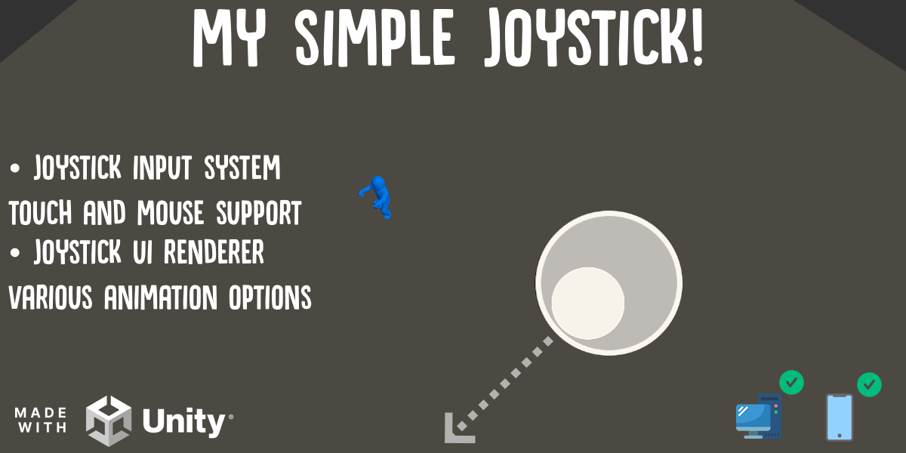
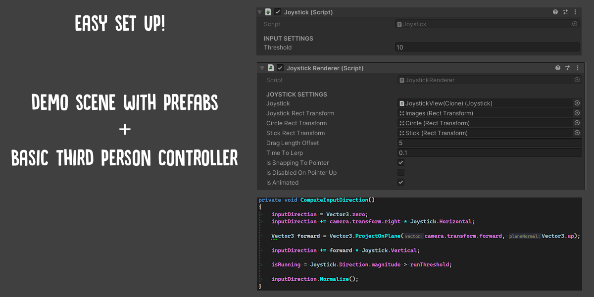
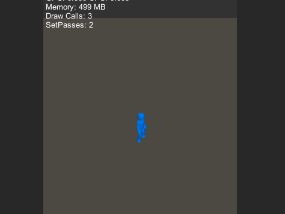

# My-Simple-Joystick
My Simple Joystick is an Input system that work both with touch or mouse inputs and that can be used with or without provided Joystick UI with various animations options!

🔄 SOON AVAILABLE ON THE UNITY ASSET STORE [LINK INCOMING]

# Description

Joystick Input and optional UI Render with different animation options.

Start easily your project based on Joystick control without worrying about how to manage your touch or mouse inputs!

Demo Scene with set up example and basic third person controller are provided.

Drag an Drop the prefab and start your awesome mobile projet! 🚀

# Technical details

* Joystick Input System hineriting from IPointerDownHandler, IPointerUpHandler, IDragHandler interfaces to handle both tactile or mouse data
* Joystick Renderer with various options
#

|Unity Render Pipeline | | |
|-|-|-|
| Built-in | URP | HDRP |
| Compatible ✅ | Compatible ✅ | Compatible ✅ | 
#

